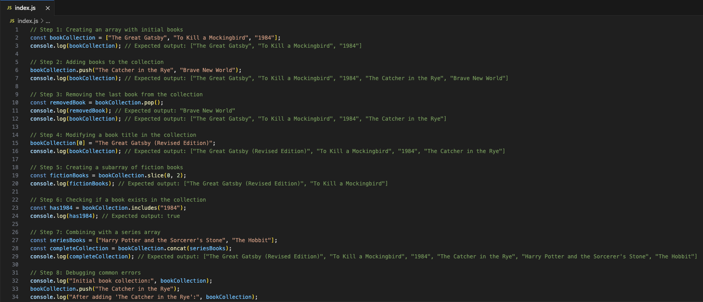

# JavaScript Basics: Arrays


## Description 📄
In this project, you will learn to work with arrays in JavaScript. You will explore how to create, access, and modify array elements, as well as perform common operations such as adding and removing items. This hands-on experience will help you understand the practical applications of arrays in managing data efficiently and troubleshooting common issues related to them.

## Expected Project Structure 🏗️
Your project will have the following structure:
```
ArraysProject/
└── index.js
```

# Instructions ✅

## 1. **Create the Project Folder and File**
You will begin by setting up your project structure.

- [ ] Create a folder named `ArraysProject` to store your project files.
- [ ] Inside the `ArraysProject` folder, create a file named `index.js`. This file will contain all your JavaScript code.

---

## 2. **Create a Book Collection Array**
You will start by creating an array to store a list of books.

- [ ] In your `index.js` file, add the following code to create an array called `bookCollection` with a few initial books:

```javascript
// Step 1: Creating an array with initial books
const bookCollection = ["The Great Gatsby", "To Kill a Mockingbird", "1984"];
console.log(bookCollection); // Expected output: ["The Great Gatsby", "To Kill a Mockingbird", "1984"]
```

- [ ] Run your JavaScript file in the terminal with the command `node index.js` to see your array.

**Expected Output:**
```
[ 'The Great Gatsby', 'To Kill a Mockingbird', '1984' ]
```

**Explanation:**
- The variable `bookCollection` holds an array containing three book titles. 
- The `console.log()` function prints the array to the console, displaying the list of books you have added.

---

## 3. **Adding Books to the Collection**
Next, you can learn to add more books to your array using the `.push()` method.

- [ ] Update your `index.js` file to add two new books, `"The Catcher in the Rye"` and `"Brave New World"`:

```javascript
// Step 2: Adding books to the collection
bookCollection.push("The Catcher in the Rye", "Brave New World");
console.log(bookCollection); // Expected output: ["The Great Gatsby", "To Kill a Mockingbird", "1984", "The Catcher in the Rye", "Brave New World"]
```

- [ ] Run your JavaScript file again to see the updated array.

**Expected Output:**
```
[ 'The Great Gatsby', 'To Kill a Mockingbird', '1984', 'The Catcher in the Rye', 'Brave New World' ]
```

**Explanation:**
- The `.push()` method adds new elements to the end of the array. 
- After this operation, the `bookCollection` now contains five book titles, demonstrating how to expand your data structure.

---

## 4. **Removing a Book from the Collection**
You will now learn to remove the last book using the `.pop()` method.

- [ ] Add the following code to your `index.js` to remove the last book from your `bookCollection`:

```javascript
// Step 3: Removing the last book from the collection
const removedBook = bookCollection.pop();
console.log(removedBook); // Expected output: "Brave New World"
console.log(bookCollection); // Expected output: ["The Great Gatsby", "To Kill a Mockingbird", "1984", "The Catcher in the Rye"]
```

- [ ] Run your JavaScript file to see the removal in action.

**Expected Output:**
```
Brave New World
[ 'The Great Gatsby', 'To Kill a Mockingbird', '1984', 'The Catcher in the Rye' ]
```

**Explanation:**
- The `.pop()` method removes the last element from the array and returns it.
- You will see the last book removed from the collection, reflecting the updated state of `bookCollection`.

---

## 5. **Accessing and Modifying Books in the Collection**
Next, you can learn to access and modify books within your array.

- [ ] Update your `index.js` file to access the first book and change it to `"The Great Gatsby (Revised Edition)"`:

```javascript
// Step 4: Modifying a book title in the collection
bookCollection[0] = "The Great Gatsby (Revised Edition)";
console.log(bookCollection); // Expected output: ["The Great Gatsby (Revised Edition)", "To Kill a Mockingbird", "1984", "The Catcher in the Rye"]
```

- [ ] Run the file to check your changes.

**Expected Output:**
```
[ 'The Great Gatsby (Revised Edition)', 'To Kill a Mockingbird', '1984', 'The Catcher in the Rye' ]
```

**Explanation:**
- You can access array elements using their index, which starts from 0.
- The first book title is updated, and this change is reflected in the output, demonstrating how to modify elements within an array.
---

## 6. **Creating a Subarray of Fiction Books**
You will now learn how to extract a portion of the array using the `.slice()` method.

- [ ] In your `index.js` file, create a subarray containing the first two books:

```javascript
// Step 5: Creating a subarray of fiction books
const fictionBooks = bookCollection.slice(0, 2);
console.log(fictionBooks); // Expected output: ["The Great Gatsby (Revised Edition)", "To Kill a Mockingbird"]
```

- [ ] Run the file to see your subarray.

**Expected Output:**
```
[ 'The Great Gatsby (Revised Edition)', 'To Kill a Mockingbird' ]
```

**Explanation:**
- The `.slice(startIndex, endIndex)` method creates a new array from the original array.
- It includes elements from the start index up to, but not including, the end index.

---

## 7. **Checking for a Book in the Collection**
You will learn how to check if a specific book exists in your array using the `.includes()` method.

- [ ] Add the following code to check if `"1984"` is in your `bookCollection`:

```javascript
// Step 6: Checking if a book exists in the collection
const has1984 = bookCollection.includes("1984");
console.log(has1984); // Expected output: true
```

- [ ] Run the file to see the result.

**Expected Output:**
```
true
```

**Explanation:**
- The `.includes()` method checks for the presence of an item and returns `true` if found or `false` if not.

---

## 8. **Combining with a Series Array**
Next, you can learn how to combine your `bookCollection` with a series array using the `.concat()` method.

- [ ] Create another array called `seriesBooks` and combine it with `bookCollection`:

```javascript
// Step 7: Combining with a series array
const seriesBooks = ["Harry Potter and the Sorcerer's Stone", "The Hobbit"];
const completeCollection = bookCollection.concat(seriesBooks);
console.log(completeCollection); // Expected output: ["The Great Gatsby (Revised Edition)", "To Kill a Mockingbird", "1984", "The Catcher in the Rye", "Harry Potter and the Sorcerer's Stone", "The Hobbit"]
```

- [ ] Run the file to see the combined array.

**Expected Output:**
```
[ 'The Great Gatsby (Revised Edition)', 'To Kill a Mockingbird', '1984', 'The Catcher in the Rye', 'Harry Potter and the Sorcerer's Stone', 'The Hobbit' ]
```

**Explanation:**
- The `.concat()` method merges two or more arrays without modifying the original arrays, demonstrating how to expand your data structure further.

---

## 9. **Debugging Common Errors**
You will use `console.log()` to monitor the state of your array throughout your code to catch errors.

- [ ] Add `console.log()` statements at key points in your `index.js` to track changes:

```javascript
// Step 8: Debugging common errors
console.log("Initial book collection:", bookCollection);
bookCollection.push("The Catcher in the Rye");
console.log("After adding 'The Catcher in the Rye':", bookCollection);
```

**Explanation:**
- Logging the state of your array helps identify issues, such as incorrect values or unexpected results, enhancing your debugging skills.

---

## 10. **Test Your Knowledge**
Finally, you can practice your skills by writing additional code using what you’ve learned about arrays. Consider creating an array of your favorite recipes, adding and removing titles, checking for specific recipes, and creating subarrays based on categories like appetizers or desserts.

---

## 11. **Commit and Push to GitHub**
Ensure you commit your work to your local Git repository and push it to GitHub.

---

# Conclusion 📄
In this project, you learned how to create and manipulate arrays in JavaScript, including adding, removing, accessing, and modifying elements. You also explored how to create subarrays, check for item existence, combine arrays, and debug common errors. These foundational skills will enable you to manage data effectively in your JavaScript programs.

---

### Solution Codebase 👀
🛑 **Only use this as a reference** 🛑  
💾 **Not something to copy and paste** 💾  
**Note:** This lab references a solution file located here.
